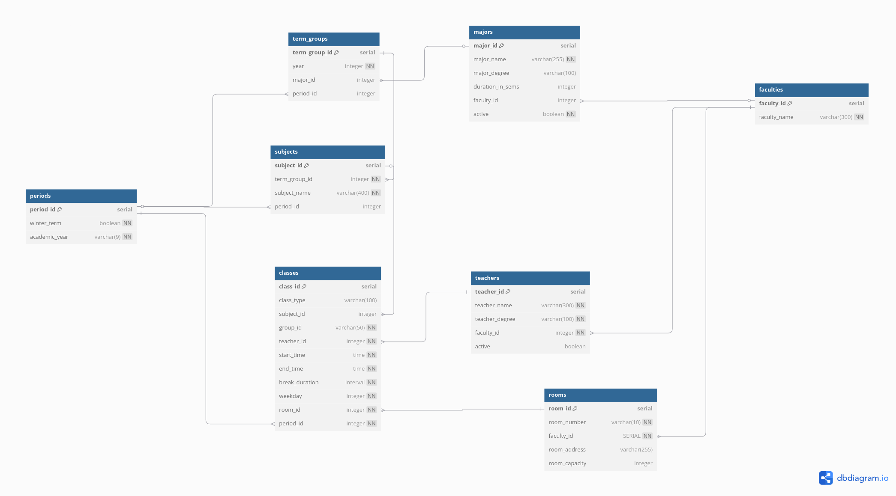

# Database Documentation

## 1. **Logical Structure Diagram**

Or, alternatively, check the diagram od [dbdiagram.io](https://dbdiagram.io/d/67f89ec84f7afba18431cff8)

> If above diagram and below docs differs, probably docs are correct.

---

## 2. **Tables**

### 2.1 **Faculties**

**Description**: Table represents faculties or other didactic units (such as Physical Culture Center). It provides info
about units for other tables, as specified above.

| **Field Name** | **Description**                    | **Constraints**         |
|----------------|------------------------------------|-------------------------|
| `faculty_id`   | Unique identifier for the faculty. | Primary Key, serial.    |
| `faculty_name` | Name of the faculty / unit.        | Not null, varchar(300). |

---

### 2.2 **Periods**

**Description**: This table represents sessions or periods in a historical context, such as the Winter term of the
2025/2026 academic year.
It provides information about periods to other tables, as referenced in the diagram above.

| **Field Name**  | **Description**                                  | **Constraints**                                      |
|-----------------|--------------------------------------------------|------------------------------------------------------|
| `period_id`     | Unique identifier for the academic period.       | Primary Key, serial.                                 |
| `winter_term`   | `true` for winter term, `false` for summer term. | Not null, boolean.                                   |
| `academic_year` | Academic year in the format `YYYY/YYYY`.         | Not null, varchar(9), Regex: `'2[0-9]{3}/[0-9]{4}'`. |

---

### 2.3 **Rooms**

**Description**: This table provides information about classroom. It is assumed each classroom belongs to precisely one
faculty (or unit), so there is not-nullable foreign key to `faculty_id`.

| **Field Name**  | **Description**                               | **Constraints**                                  |
|-----------------|-----------------------------------------------|--------------------------------------------------|
| `room_id`       | Unique identifier for the room.               | Primary Key, serial.                             |
| `room_number`   | Number or identifier of the room.             | Not null, varchar(10).                           |
| `faculty_id`    | Reference to the faculty the room belongs to. | Foreign Key (`faculties(faculty_id)`), not null. |
| `room_address`  | Address or location of the room. Nullable.    | Varchar(255).                                    |
| `room_capacity` | Maximum capacity of the room. Nullable        | Integer, must be greater than 0 (`CHECK`).       |

---

### 2.4 **Majors**

**Description** This table represents info about majors (pol. *Kierunek studiów*). We assume each major is conducted by
precisely one faculty.

**Notes**:

- For non long-cycle studies, `major_name` is stored in the convention: `<name_of_programme> <degree level>`, for
  example `Informatyka I st.`.
- Although `duration_in_sems` is nullable, it is highly recommend to store it. It allows for list all `term_groups` in
  the major.

| **Field Name**     | **Description**                                    | **Constraints**                            |
|--------------------|----------------------------------------------------|--------------------------------------------|
| `major_id`         | Unique identifier for the major.                   | Primary Key, serial.                       |
| `major_name`       | Name of the major program.                         | Not null, varchar(255).                    |
| `major_degree`     | Degree associated with the major program. Nullable | Varchar(100).                              |
| `duration_in_sems` | Duration of the major in semesters. Nullable.      | Integer, must be greater than 0 (`CHECK`). |
| `faculty_id`       | Reference to the faculty offering the major.       | Foreign Key (`faculties(faculty_id)`).     |
| `active`           | Indicates if the major is currently active.        | Not null, boolean.                         |

---

### 2.5 **Term Groups**

**Description**:
This table stores information about college level group (pol. *semestr*) in the context of students group on the same
college level.
That entries are linked with subjects that are conducted for them.

**Notes**:

- Each **term** will be another term group, even if it is composed of the same people.
- It allows linking subjects to sessions and archiving them.

| **Field Name**  | **Description**                                             | **Constraints**                                   |
|-----------------|-------------------------------------------------------------|---------------------------------------------------|
| `term_group_id` | Unique identifier for a term group of students.             | Primary Key, serial.                              |
| `year`          | Year of studies, integer  	                                 | Integer, not null, `CHECK(year BETWEEN 1 AND 7)`. |
| `major_id`      | Reference to the major associated with this group.          | Foreign Key (`majors(major_id)`).                 |
| `period_id`     | Reference to an academic period associated with this group. | Foreign Key (`periods(period_id)`).               |

---

### 2.6 **Teachers**

**Description** The table stores information about all teachers (lecturers and instructors) who conducts classess.
We assume all teachers are employed in precisely one university unit.
`teacher_degree` should be provided in the shortened form, i.e. `ks. dr. hab. inż. n. med., prof. UMCS` or something
long like that.

| **Field Name**   | **Description**                               | **Constraints**                                  |
|------------------|-----------------------------------------------|--------------------------------------------------|
| `teacher_id`     | Unique identifier for the teacher.            | Primary Key, serial.                             |
| `teacher_name`   | Full name of the teacher.                     | Not null, varchar(300).                          |
| `teacher_degree` | Degree or qualification of the teacher.       | Not null, varchar(100).                          |
| `faculty_id`     | Reference to the faculty where they teach.    | Foreign Key (`faculties(faculty_id)`), not null. |
| `active`         | Indicates if the teacher is currently active. | Boolean (optional).                              |

---

### 2.7 **Subjects**

**Description**:
This table stores information about subjects that take place (or took place at some point) at the university. A subject
is composed of one or more classes objects.

**Notes**:

- The same subject in different periods is represented as a separate entry in this table. For example, 'Algorithmics' in
  the 2025 Winter term is a different entry than the same subject offered a year earlier.
- `tgroup` is a foreign key to the `term_group` table. Each subject belongs to precisely one `term_group` object.

| **Field Name**  | **Description**                                          | **Constraints**                                               |
|-----------------|----------------------------------------------------------|---------------------------------------------------------------|
| `subject_id`    | Unique identifier for the subject.                       | Primary Key, serial.                                          |
| `term_group_id` | Identifier for term groups associated with this subject. | Integer, not null. Foreign Key (`term_groups(term_group_id)`) |
| `subject_name`  | Name of the subject being taught.                        | Not null, varchar(400).                                       |
| `period_id`     | Reference to the academic period when it's taught.       | Foreign Key (`periods(period_id)`).                           |

---

### 2.8 **Classes**

**Description**:
Final and central table of the database. It stores one, atomic class. Each form of class of every subject is another
`classes` entry

| **Field Name**   | **Description**                                                          | **Constraints**                                 |
|------------------|--------------------------------------------------------------------------|-------------------------------------------------|
| `class_id`       | Unique identifier for the class session.                                 | Primary Key, serial.                            |
| `class_type`     | Type of class (e.g., lecture, lab).                                      | Varchar(100).                                   |
| `subject_id`     | Reference to the subject being taught in this class.                     | Foreign Key (`subjects(subject_id)`).           |
| `group_id`       | Identifier for student groups attending this class.                      | Varchar(50), not null.                          |
| `teacher_id`     | Reference to the teacher conducting this class.                          | Foreign Key (`teachers(teacher_id)`), not null. |
| `start_time`     | Start time of the class session.                                         | Time, not null.                                 |
| `end_time`       | End time of the class session.                                           | Time, not null.                                 |
| `break_duration` | Duration of breaks during class sessions (if any).                       | Interval, must be >= 0 (`CHECK`), not null.     |
| `weekday`        | Day of the week when this class is held (0 = Sunday to 6 = Saturday).  	 | Integer between 0 and 6 (`CHECK`).              |
| `room_id`        | Reference to the room where this class is held.                          | Foreign Key (`rooms(room_id)`), not null.       |
| `period_id`      | Reference to the academic period for this class.                         | Foreign Key (`periods(period_id)`), not null.   |

---

## Relationships Overview

1. Faculties are referenced by rooms, majors, and teachers.
2. Periods are referenced by subjects, classes, and term groups.
3. Majors are linked to term groups.
4. Teachers conduct classes and are part of faculties.
5. Classes involve subjects and occur in specific rooms during periods.
6. Term groups organize students by major and academic year.

# Database Users

There are three kind of users in the database:

1. Administrator - which has full control over the server
2. Editor - used by crawlers, has access to `Timetable` database only, can add entries to tables.
3. Viewer - used by API, has access to `Timetable` database only, cannot make any modifications on tables.

## Credentials

For gain access to database, please contact with me (Filip Uliasz). I will prepare user for your component and send you
credentials.

> REMEBER TO NOT HARDCODE CREDENTIALS TO DATABASE. STORE THEM IN `.env` FILE INSTEAD. 